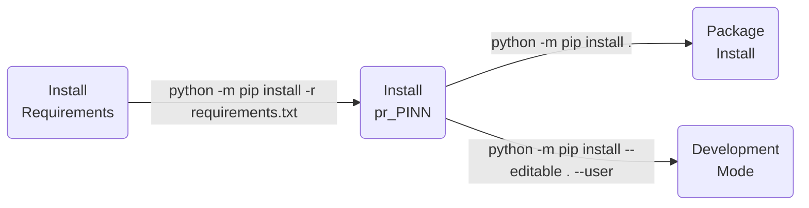

| **Authors**  | **Project** |  **Documentation** | **Build Status** | **Code Quality** | **Coverage** |
|:------------:|:-----------:|:------------------:|:----------------:|:----------------:|:------------:|
| [**F. Colombo**](https://github.com/xover92) <br/> S&C26 student | **pr_PINN** | [](https://github.com/xover92/pr_PINN/actions/workflows/docs.yml) | [](https://github.com/xover92/pr_PINN/actions/workflows/python.yml) | [](https://app.codacy.com/gh/xover92/pr_PINN/dashboard?utm_source=gh&utm_medium=referral&utm_content=&utm_campaign=Badge_grade) | **TODO** |

[](https://github.com/xover92/pr_PINN/pulls)
[](https://github.com/xover92/pr_PINN/issues)

[](https://github.com/xover92/pr_PINN/stargazers)
[](https://github.com/xover92/pr_PINN/watchers)

<a href="https://github.com/UniboDIFABiophysics">
  <div class="image">
    
  </div>
</a>

# pr_PINN v0.0.2

## Project for the Pattern recognition and Software&Computing course (aa 2025-26)

This is a project developed for the Pattern recognition and Software&Computing courses of the Applied Physics curriculum.


* [Overview](#overview)
* [Prerequisites](#prerequisites)
* [Installation](#installation)
* [Usage](#usage)
* [Testing](#testing)
* [Table of contents](#table-of-contents)
* [Contribution](#contribution)
* [References](#references)
* [Authors](#authors)
* [License](#license)
* [Acknowledgments](#acknowledgments)
* [Citation](#citation)

## Overview

This project, developed for the courses of Pattern Recognition and Software&computing for applied physics, consists of a PINN that solves the Fisher-KPP equation in 1D (2D and 3D coming soon). The program is developed with user-friendliness in mind, and as such runs on gradio, which allows it to have a simple GUI.

## Prerequisites

The complete list of requirements for the `pr_PINN` package is reported in the [requirements.txt](https://github.com/xover92/pr_PINN/blob/main/requirements.txt)

## Installation

Python version supported : 

The `Python` installation for *developers* is executed using [`setup.py`](https://github.com/xover92/pr_PINN/blob/main/setup.py) script.



## Usage

You can use the `pr_PINN` library into your Python scripts or directly via command line.

### Command Line Interface

The `pr_PINN` package can be used directly via command line using the following syntax:

```bash
$ pr_PINN --help
usage: pr_PINN [-h] [--version]

options:
  -h, --help            show this help message and exit
  --version, -v         Get the current version installed
```

In order to run it, type:
```bash
$ python -m pr_PINN
```
When ran, it will show a local link. By clicking on it, you will access the gradio GUI, where you will be able to test the program.
## Testing

**TODO**

## Table of contents

**TODO**

## Contribution

No contribution is allowed, since this is a project meant for university.

## References

<blockquote>1- Aberqui et al, "Solving the Fisher nonlinear differential equations via Physics-Informed Neural Networks: A Comprehensive Retraining Study and Comparative Analysis with the Finite Difference Method", Numerical Analysis, 2026, https://arxiv.org/abs/2601.11406 </blockquote>

## Authors

*  **Francesco Colombo**

See also the list of [contributors](https://github.com/xover92/pr_PINN/contributors) [](https://github.com/xover92/pr_PINN/graphs/contributors/) who participated in this project.

## License

The `pr_PINN` package is licensed under the GPLv3 [License](https://github.com/xover92/pr_PINN/blob/main/LICENSE).

## Acknowledgments

Thanks goes to all contributors of this project.

## Citation

If you have found `pr_PINN` helpful in your research, please consider citing the original repository

```BibTeX
@misc{pr_PINN,
  author = {Colombo, Francesco},
  title = {pr_PINN - Pattern Recognition exam: Physics Informed Neural Network},
  year = {2026},
  publisher = {GitHub},
  howpublished = {\url{https://github.com/xover92/pr_PINN}}
}
```