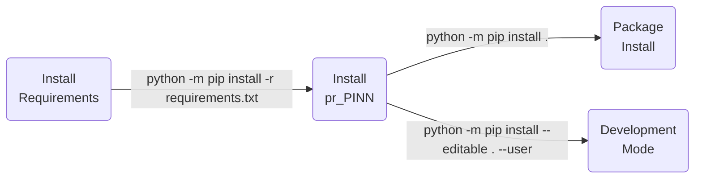

| **Authors**  | **Project** |  **Documentation** | **Build Status** | **Code Quality** | **Coverage** |
|:------------:|:-----------:|:------------------:|:----------------:|:----------------:|:------------:|
| [**F. Colombo**](https://github.com/xover92) <br/> S&C26 student | **pr_PINN** | [](https://github.com/xover92/pr_PINN/actions/workflows/docs.yml) | [](https://github.com/xover92/pr_PINN/actions/workflows/python.yml) | [](https://app.codacy.com/gh/xover92/pr_PINN/dashboard?utm_source=gh&utm_medium=referral&utm_content=&utm_campaign=Badge_grade) | [](https://app.codacy.com/gh/xover92/pr_PINN/dashboard?utm_source=gh&utm_medium=referral&utm_content=&utm_campaign=Badge_coverage) |

[](https://github.com/xover92/pr_PINN/pulls)
[](https://github.com/xover92/pr_PINN/issues)

[](https://github.com/xover92/pr_PINN/stargazers)
[](https://github.com/xover92/pr_PINN/watchers)

<a>
  <div class="image">
    
  </div>
</a>

# pr_PINN v0.2.3

## Project for the Pattern recognition and Software&Computing course (aa 2025-26)

This is a project developed for the Pattern recognition and Software&Computing courses of the Applied Physics curriculum.


* [Overview](#overview)
* [Introduction](#introduction)
* [Theoretical overview](#theoretical-overview)
* [Program Architecture](#program-architecture)
* [Results](#results)
* [Future developments](#future-developments)
* [Prerequisites](#prerequisites)
* [Installation](#installation)
* [Usage](#usage)
* [Testing](#testing)
* [Contribution](#contribution)
* [References](#references)
* [Authors](#authors)
* [License](#license)
* [Citation](#citation)

## Overview

This project, developed for the courses of Pattern Recognition and Software&computing for applied physics, consists of a PINN that solves the Fisher-KPP equation in 1D, 2D and 3D. The program is developed with user-friendliness in mind, and as such runs on gradio, which allows it to have a simple GUI.

## Introduction

**TODO**

## Theoretical overview

In this section, I will overview some basic PDE-related and ML concepts, and introduce the concept of PINNs. I will be very brief on purpose, since I expect the reader to have some kind of familiarity with the concept of NNs and, in general, some basic grasp on ML.

### The KPP-Fisher equation

A reaction-diffusion equation is a partial differential equation (PDE) that equates the temporal derivative to the sum between the laplacian of a function $u(\vec{x}, t)$, and another function of that same $u(\vec{x}, t)$, named $f(u)$, both multiplied by coefficients as such:
$$\frac{\delta u(\vec{x}, t)}{\delta t}=D\nabla^2u(\vec{x}, t)+Rf(u(\vec{x}, t))$$
Where D is the diffusion coefficient and R is the reaction coefficient. [2]

One of the simplest nonlinear reaction-diffusions equations is given by the KPP-Fisher equation, whose name comes from the fact that it was first studied indipendently by a group consisting of Andrey Kolmogorov, Ivan Petrovsky and Nikolai Piskunov (hence KPP) and by Ronald Fisher, by himself, and then published in 1937. Remarkably, the former were studying it in general for reaction-diffusion systems in 2D, while the latter was studying a more precise equation in 1D applied on the diffusion of species [3]. This should hint at the veratility of such an equation, which commonly takes the form of:
$$\frac{\delta u(\vec{x}, t)}{\delta t}=D\nabla^2u(\vec{x}, t)+Ru(1-u)$$

As it happens oftentimes with PDEs, finding an analytical solution is hardly possible. One remarkable result comes by Ablowitz and Zeppetella [1], which found an exact solution for a given traveling wave speed of $\pm\frac{5}{\sqrt{6}}$ in 1D, namely:
$$u(x, t)=(1+e^{\sqrt{\frac{R}{6D}}x-\frac{5Rt}{6}})^{-2}$$

### Physics Informed Neural Networks (PINNs)

As the the reader may be aware of, neural networks are computational models isnpired from, as the name suggests, biological neural networks. Neural networks have been proven greatly for many tasks, one of them being function approximations. As with most ML techniques, the whole idea is based on the loss function, which is a function that encodes, for the machine, its objective: the goal of the machine is to tune its parameters in order to minimize the loss function. In the case of NNs, the parameters are the weights connecting the "neurons", plus a bias for each neuron. Apart from the inputs, neurons are values determined by the som of the value of the preceding neurons multiplied by the corresponding weights, plus a bias, passed through an activation function. [4]
<a>
  <div class="image">
    
    <figcaption>Functioning of a single neuron.</figcaption>
  </div>
</a>

<a>
  <div class="image">
    
    <figcaption>Schematic representation of a NN.</figcaption>
  </div>
</a>

Physics Informed Neural Networks (PINNs) are a somewhat special king of NN. Their main characteristic, as suggested by the name, is that their loss function encapsulates a physical law. This was made possible fairly recently (2019) thanks to leaps forward in the area of automatic differentiation. The basic idea is that the loss function could contain the residual of a PDE as a loss term, and as such the machine could be "informed" of the physics behind the system, and, by making use of the well known ability of deep neural networks as universal function approximators [5], find an approximate solution.

There are two ways in which a PINN may be used: forward and inverse problems. Forward problems are those in which the PDE is known, as the boundary and initial conditions. Inverse problems include inverting the model parameters and boundary conditions from data [6]. This project, for now, solves only direct problems.

## Program architecture

**TODO**

## Results

**TODO**

## Future developments

**TODO**

## Prerequisites

The complete list of requirements for the `pr_PINN` package is reported in the [requirements.txt](https://github.com/xover92/pr_PINN/blob/main/requirements.txt)

## Installation

Python version supported : 

The `Python` installation for *developers* is executed using [`setup.py`](https://github.com/xover92/pr_PINN/blob/main/setup.py) script.


```mermaid
graph LR;
    A(Install<br>Requirements) -->|python -m pip install -r requirements.txt| B(Install<br>pr_PINN)
    B -->|python -m pip install .| C(Package<br>Install)
    B -->|python -m pip install --editable . --user| D(Development<br>Mode)
```

## Usage

You can use the `pr_PINN` library into your Python scripts or directly via command line.

### Command Line Interface

The `pr_PINN` package can be used directly via command line using the following syntax:

```bash
$ pr_PINN --help
usage: pr_PINN [-h] [--version]

options:
  -h, --help            show this help message and exit
  --version, -v         Get the current version installed
```

In order to run it, type:
```bash
$ python -m pr_PINN
```
When ran, it will show a local link. By clicking on it, you will access the gradio GUI, where you will be able to use the program.
## Testing

### How to test

The project's testing was written using pytest, and as such the command line command to test it is, once in the project's folder:
```bash
$ python -m pytest -v ./test/
```
## Contribution

No contribution is allowed, since this is a project meant for university.

## References

<blockquote>1- Ablowitz, M.J., Zeppetella, A. Explicit solutions of Fisher's equation for a special wave speed. Bltn Mathcal Biology 41, 835–840 (1979). https://doi.org/10.1007/BF02462380 </blockquote>
<blockquote>2- Soh S, Byrska M, Kandere-Grzybowska K, Grzybowski BA. Reaction-diffusion systems in intracellular molecular transport and control. Angew Chem Int Ed Engl. 2010 Jun 7;49(25):4170-98. doi: 10.1002/anie.200905513. PMID: 20518023; PMCID: PMC3697936</blockquote>
<blockquote>3- Lloyd N. Trefethen and Kristine Embree, THE (UNFINISHED) PDE COFFEE TABLE BOOK, Unpublished, 2001, chapter 37, https://people.maths.ox.ac.uk/trefethen/pdectb/fisher2.pdf </blockquote>
<blockquote>4- Larry Hardesty, Explained: Neural Networks, MIT News, 2017, https://news.mit.edu/2017/explained-neural-networks-deep-learning-0414 </blockquote>
<blockquote>5- M. Raissi, P. Perdikaris, G.E. Karniadakis, Physics-informed neural networks: A deep learning framework for solving forward and inverse problems involving nonlinear partial differential equations, Journal of Computational Physics, Volume 378, 2019, Pages 686-707, ISSN 0021-9991, https://doi.org/10.1016/j.jcp.2018.10.045 </blockquote>
<blockquote>6- Fan Yang, Hao Liu, Xiao-Xiao Li, Jian-Xiong Cao, PINN neural network method for solving the forward and inverse problem of time-fractional telegraph equation, Results in Engineering, Volume 25, 2025, 103997, ISSN 2590-1230, https://doi.org/10.1016/j.rineng.2025.103997</blockquote>

## Authors

*  **Francesco Colombo**

See also the list of [contributors](https://github.com/xover92/pr_PINN/contributors) [](https://github.com/xover92/pr_PINN/graphs/contributors/) who participated in this project.

## License

The `pr_PINN` package is licensed under the GPLv3 [License](https://github.com/xover92/pr_PINN/blob/main/LICENSE).

## Citation

If you have found `pr_PINN` helpful in your research, please consider citing the original repository

```BibTeX
@misc{pr_PINN,
  author = {Colombo, Francesco},
  title = {pr_PINN - Pattern Recognition exam: Physics Informed Neural Network},
  year = {2026},
  publisher = {GitHub},
  howpublished = {\url{https://github.com/xover92/pr_PINN}}
}
```