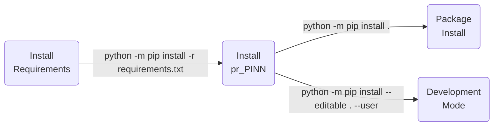

| **Authors**  | **Project** |  **Documentation** | **Build Status** | **Code Quality** | **Coverage** |
|:------------:|:-----------:|:------------------:|:----------------:|:----------------:|:------------:|
| [**F. Colombo**](https://github.com/xover92) <br/> S&C26 student | **pr_PINN** | [](https://github.com/xover92/pr_PINN/actions/workflows/docs.yml) | [](https://github.com/xover92/pr_PINN/actions/workflows/python.yml) | [](https://app.codacy.com/gh/xover92/pr_PINN/dashboard?utm_source=gh&utm_medium=referral&utm_content=&utm_campaign=Badge_grade) | [](https://app.codacy.com/gh/xover92/pr_PINN/dashboard?utm_source=gh&utm_medium=referral&utm_content=&utm_campaign=Badge_coverage) |

[](https://github.com/xover92/pr_PINN/pulls)
[](https://github.com/xover92/pr_PINN/issues)

[](https://github.com/xover92/pr_PINN/stargazers)
[](https://github.com/xover92/pr_PINN/watchers)

<a>
  <div class="image">
    
  </div>
</a>

# pr_PINN v0.2.6

## Project for the Pattern recognition and Software&Computing course (aa 2025-26)

This is a project developed for the Pattern recognition and Software&Computing courses of the Applied Physics curriculum.


* [Overview](#overview)
* [Introduction](#introduction)
* [Theoretical overview](#theoretical-overview)
* [Program Architecture](#program-architecture)
* [Results](#results)
* [Future developments](#future-developments)
* [Prerequisites](#prerequisites)
* [Installation](#installation)
* [Usage](#usage)
* [Testing](#testing)
* [Contribution](#contribution)
* [References](#references)
* [Authors](#authors)
* [License](#license)
* [Citation](#citation)

## Overview

This project, developed for the courses of Pattern Recognition and Software&computing for applied physics, consists of a PINN that solves the Fisher-KPP equation in 1D, 2D and 3D. The program is developed with user-friendliness in mind, and as such runs on gradio, which allows it to have a simple GUI.

## Introduction

**TODO**

## Theoretical overview

In this section, I will overview some basic PDE-related and ML concepts, and introduce the concept of PINNs. I will be very brief on purpose, since I expect the reader to have some kind of familiarity with the concept of NNs and, in general, some basic grasp on ML.

### The KPP-Fisher equation

A reaction-diffusion equation is a partial differential equation (PDE) that equates the temporal derivative to the sum between the laplacian of a function $u\left(\vec{x}, t\right)$, and another function of that same $u\left(\vec{x}, t\right)$, named $f\left(u\right)$, both multiplied by coefficients as such:

$$
\frac{\delta u\left(\vec{x}, t\right)}{\delta t}=D\nabla^2u\left(\vec{x}, t\right)+Rf\left(u\left(\vec{x}, t\right)\right)
$$

Where D is the diffusion coefficient and R is the reaction coefficient. [2]

One of the simplest nonlinear reaction-diffusions equations is given by the KPP-Fisher equation, whose name comes from the fact that it was first studied indipendently by a group consisting of Andrey Kolmogorov, Ivan Petrovsky and Nikolai Piskunov (hence KPP) and by Ronald Fisher, by himself, and then published in 1937. Remarkably, the former were studying it in general for reaction-diffusion systems in 2D, while the latter was studying a more precise equation in 1D applied on the diffusion of species [3]. This should hint at the veratility of such an equation, which commonly takes the form of:

$$
\frac{\delta u\left(\vec{x}, t\right)}{\delta t}=D\nabla^2u\left(\vec{x}, t\right)+Ru\left(1-u\right)
$$

As it happens oftentimes with PDEs, finding an analytical solution is hardly possible. One remarkable result comes by Ablowitz and Zeppetella [1], which found an exact solution for a given traveling wave speed of $\pm\frac{5}{\sqrt{6}}$ in 1D, namely:

<a id="eq:zepp"></a>
$$
u\left(x, t\right)=\left(1+e^{\sqrt{\frac{R}{6D}}x-\frac{5Rt}{6}}\right)^{-2}
$$

In the case of a sphere or a cicle, and radially symmetrical initial and boundary conditions, the Fisher-KPP equation simplifies as:

<a id="eq:radial"></a>
$$
\frac{\delta u}{\delta t}=D(\frac{\delta^2u}{\delta r^2}+\frac{d-1}{r}\frac{\delta u}{\delta r})+Ru(1-u)
$$

where d is equal to the number of spatial dimensions (i.e. 2 for the circle, 3 for the sphere). [7]
### Physics Informed Neural Networks (PINNs)

As the reader may be aware of, neural networks are computational models inspired from, as the name suggests, biological neural networks. Neural networks have been proven greatly for many tasks, one of them being function approximations. As with most ML techniques, the whole idea is based on the loss function, which is a function that encodes, for the machine, its objective: the goal of the machine is to tune its parameters in order to minimize the loss function. In the case of NNs, the parameters are the weights connecting the "neurons", plus a bias for each neuron. Apart from the inputs, neurons are values determined by the some of the value of the preceding neurons multiplied by the corresponding weights, plus a bias, passed through an activation function. [4]


<a>
  <div class="image">
    
    <figcaption>Functioning of a single neuron.</figcaption>
  </div>
</a>

<a>
  <div class="image">
    
    <figcaption>Schematic representation of a NN.</figcaption>
  </div>
</a>


Physics Informed Neural Networks (PINNs) are a somewhat special king of NN. Their main characteristic, as suggested by the name, is that their loss function encapsulates a physical law. This was made possible fairly recently (2019) thanks to leaps forward in the area of automatic differentiation. The basic idea is that the loss function could contain the residual of a PDE as a loss term, and as such the machine could be "informed" of the physics behind the system, and, by making use of the well known ability of deep neural networks as universal function approximators [5], find an approximate solution.

There are two ways in which a PINN may be used: forward and inverse problems. Forward problems are those in which the PDE is known, as the boundary and initial conditions. Inverse problems include inverting the model parameters and boundary conditions from data [6]. This project, for now, solves only direct problems.

## Program architecture

In this section, I will explain the basic architecture of the code. I will avoid going in great implementation detail, but the reader may read the documentation at https://pr-pinn.readthedocs.io/en/latest/API/pr_PINN.html for more precise information. 

The program is equipped with an interface powered by Gradio. It provides, by using gradio.Interface, an easy way for the user to decide their inputs. 

Because of the necessities of gradio.Interface in terms of inputs and outputs, the main script is encapsulated in a function called generate_plot. The aforementioned links together the other functions, providing, with a simple series of ifs, the proper unfolding of functions based on the requested problems. As a matter of fact, the program can solve the following problems:
* **mode "exact"**: solves, in 1D, the problem with boundary and initials condition given by the solution by [eq. 1](#eq:zepp);
* **mode "dirichlet"**: solves, in 1,2 and 3D the KPP-Fisher in the space [0, 1]^dim from time 0 to 1, with given (by the user) initial and boundary Dirichlet conditions;
* **mode "neumann"**: solves, in 1,2 and 3D the KPP-Fisher in the space [0, 1]^dim from time 0 to 1, with given (by the user) initial and boundary Neumann conditions (null flux);
* **mode "sphere"**: solves, in 2 and 3D the equation in the unit sphere with given initial conditions and with Neumann Boundary Condition.

In the first case, benchmarking is done by comparing the result to that given by the precise solution.
In the second and third case, benchmarking is done by comparing the result with that obtained, giving the same conditions, by fiPy, a finite volume PDE solver. 
As for the circle or the sphere, the PINN solves the problem in 2 or 3D and compares it with that obtained by the PINN itself in the simpler problems in 1D given by [eq.2](#eq:radial).

The basic architecture works as follows:
1. The mode is selected:
    * if the mode is not "exact", you select the boundary conditions and the dimension.
2. You select the number of sampling points, of epochs and of neurons per layer;
3. The program generates the PINN and the sampling points (more on that in the following subsection);
4. The program runs the number of epochs selected by computing the loss functions for the sampling points, and uses it to train the PINN;
5. Once the PINN is trained, 20^dim+1 testing points are generated;
6. The PINN is calculated on those points as well as the specific benchmarking model;
7. L2 loss is evaluated:
    * if the mode is "sphere", the maximum difference between the two estimates is also calculated. 

The data is generated and passed to the PINN as a series of torch.Tensors, one per dimension. For example, if you generated three points in 3D, you would get four Tensors of length three each. They are eventually reshaped for plotting purposes.

One implementative detail that shall be covered more thoroughly is that of the generation of sampling points, in particular that of boundary points.

### Point sampling

Point sampling is done by employing Latin Hypercube Sampling, LHS in short. This method employs a quasi-random distribution of points that, in short, divides the space in a number of evenly large intervals equal to that of the points to generate, and then selects randomly one point per interval. For example, if you had to generate two points in 1D, it would generate two random points, one in $\left[0, 0.5\right)$ and in $\left[0.5, 1\right)$. (obviously, if the number of points is lower than d you cannot actually "cover" all the space)

The method was employed to generate all the point for training, with some distinctions between the $\left[0,1\right]^{dim+1}$ space and the spherical one used for the "sphere" mode. 

In the case of the $\left[0,1\right]^{dim+1}$ space, the points were first generated inside the boundaries, then projected to them: that means that, for example, if you generated four points in 1D (we will cal each $\left(x_i; t_i\right)$), at the end you would actually have trained the PINN on 20 points: $\left(x_i; 0\right)$, $\left(x_i; 1\right)$, $\left(0; t_i\right)$, $\left(1; t_i\right)$ and $\left(x_i; t_i\right)$ for $i \in \left(1, 2, 3, 4\right)$. 

As for the spherical mode, the technique is different. First, the number of points selected by the user is generated inside the sphere/circle, by generating points with LHS with the requested dimensionality, rescaling them into polar coordinates and finally converting them into cartesian coordinates; a note: in the case of a sphere, the rescaling is not obvious as rescaling directly to an angle by multiplying, but it is done by employing arccos for spatial uniformity. Then, the same technique is employed for the boundaries, but by fixing the radius to 1 (which, operatively, means to generate points with one dimension less). As for the temporal boundaries, the technique is the same as for the other modes.

## Results

**TODO**

## Future developments

In this section, I will cover the possible future developments of the program, divided into two subsections. One is in regard to the interface, which could use an update. The other will cover, instead, one possible application in medicine.

### Interface

The program at the moment uses an interface provided by Gradio, namely a gradio.Interface. This type of interface does not update dynamically, and as such the user may, at all times and for all modes, select also parameters that the model does not actually need. For example, in "exact" mode, the user does not need to provide any initial or boundary condition, but the interface still gives them this possibility. The program still runs normally, but this can be avoided by using Gradio Blocks, which do actually update dynamically, and would provide a much better interface for the means of the program.

### Personalized predictions of Glioblastoma infiltration

**TODO**

## Prerequisites

The complete list of requirements for the `pr_PINN` package is reported in the [requirements.txt](https://github.com/xover92/pr_PINN/blob/main/requirements.txt)

## Installation

Python version supported : 

The `Python` installation for *developers* is executed using [`setup.py`](https://github.com/xover92/pr_PINN/blob/main/setup.py) script.


```mermaid
graph LR;
    A(Install<br>Requirements) -->|python -m pip install -r requirements.txt| B(Install<br>pr_PINN)
    B -->|python -m pip install .| C(Package<br>Install)
    B -->|python -m pip install --editable . --user| D(Development<br>Mode)
```

## Usage

You can use the `pr_PINN` library into your Python scripts or directly via command line.

### Command Line Interface

The `pr_PINN` package can be used directly via command line using the following syntax:

```bash
$ pr_PINN --help
usage: pr_PINN [-h] [--version]

options:
  -h, --help            show this help message and exit
  --version, -v         Get the current version installed
```

In order to run it, type:
```bash
$ python -m pr_PINN
```
When ran, it will show a local link. By clicking on it, you will access the gradio GUI, where you will be able to use the program.
## Testing

### How to test

The project's testing was written using pytest, and as such the command line command to test it is, once in the project's folder:
```bash
$ python -m pytest -v ./test/
```

### Testing approach

The main function, which is generate_plot, is tested only with a branching test and a check of the non-negativity of L2 and, eventually, the maximum difference. This ensures that, in general, the program runs at least without error. As for the functions called inside the aforementioned, various approaches were adopted depending on the function.

For the sampling functions, the tests ensure that their shape is correct and that their values are coherent with the geometry of the system. 
In the cases of the loss functions, two techniques were employed:
* In the case of the exact mode loss function, I employed oracle testing, by using the exact solution as the input model and verifying that in such case the loss would be 0;
* in all the other cases, the loss functions themselves were not tested, but the functions they depended on were, on a simple quadratic model: by using itertools, I was able to explicitate the expected functions for the boundaries or for the PDE and consequently to see if the functions that consituted the loss where calculating, in such an easy model, the correct values.

The exact solution was trivially tested by checking whether the values were as predicted, while solve_with_fipy was not tested since it only depends on fiPy methods, and if the shape were incorrect the program would produce other errors, checked by the aforementioned branching test for generate_plot.

## Contribution

No contribution is allowed, since this is a project meant for university.

## References

<blockquote>1- Ablowitz, M.J., Zeppetella, A. Explicit solutions of Fisher's equation for a special wave speed. Bltn Mathcal Biology 41, 835–840 (1979). https://doi.org/10.1007/BF02462380 </blockquote>
<blockquote>2- Soh S, Byrska M, Kandere-Grzybowska K, Grzybowski BA. Reaction-diffusion systems in intracellular molecular transport and control. Angew Chem Int Ed Engl. 2010 Jun 7;49(25):4170-98. doi: 10.1002/anie.200905513. PMID: 20518023; PMCID: PMC3697936</blockquote>
<blockquote>3- Lloyd N. Trefethen and Kristine Embree, THE (UNFINISHED) PDE COFFEE TABLE BOOK, Unpublished, 2001, chapter 37, https://people.maths.ox.ac.uk/trefethen/pdectb/fisher2.pdf </blockquote>
<blockquote>4- Larry Hardesty, Explained: Neural Networks, MIT News, 2017, https://news.mit.edu/2017/explained-neural-networks-deep-learning-0414 </blockquote>
<blockquote>5- M. Raissi, P. Perdikaris, G.E. Karniadakis, Physics-informed neural networks: A deep learning framework for solving forward and inverse problems involving nonlinear partial differential equations, Journal of Computational Physics, Volume 378, 2019, Pages 686-707, ISSN 0021-9991, https://doi.org/10.1016/j.jcp.2018.10.045 </blockquote>
<blockquote>6- Fan Yang, Hao Liu, Xiao-Xiao Li, Jian-Xiong Cao, PINN neural network method for solving the forward and inverse problem of time-fractional telegraph equation, Results in Engineering, Volume 25, 2025, 103997, ISSN 2590-1230, https://doi.org/10.1016/j.rineng.2025.103997</blockquote>
<blockquote>7- Wim van Saarloos, Front propagation into unstable states, Physics Reports, Volume 386, Issues 2–6, 2003, Pages 29-222, ISSN 0370-1573, https://doi.org/10.1016/j.physrep.2003.08.001</blockquote>
<blockquote>8- McKay, M. & Beckman, Richard & Conover, William. (1979). Comparison of Three Methods for Selecting Values of Input Variables in the Analysis of Output from a Computer Code. Technometrics. 21. 239-245. 10.1080/00401706.1979.10489755. </blockquote>

## Authors

*  **Francesco Colombo**

See also the list of [contributors](https://github.com/xover92/pr_PINN/contributors) [](https://github.com/xover92/pr_PINN/graphs/contributors/) who participated in this project.

## License

The `pr_PINN` package is licensed under the GPLv3 [License](https://github.com/xover92/pr_PINN/blob/main/LICENSE).

## Citation

If you have found `pr_PINN` helpful in your research, please consider citing the original repository

```BibTeX
@misc{pr_PINN,
  author = {Colombo, Francesco},
  title = {pr_PINN - Pattern Recognition exam: Physics Informed Neural Network},
  year = {2026},
  publisher = {GitHub},
  howpublished = {\url{https://github.com/xover92/pr_PINN}}
}
```